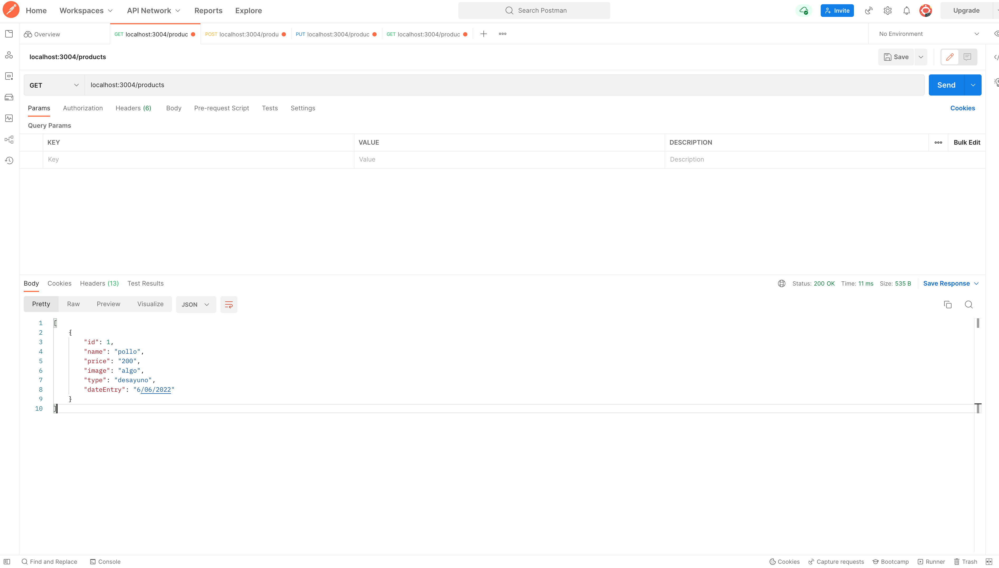
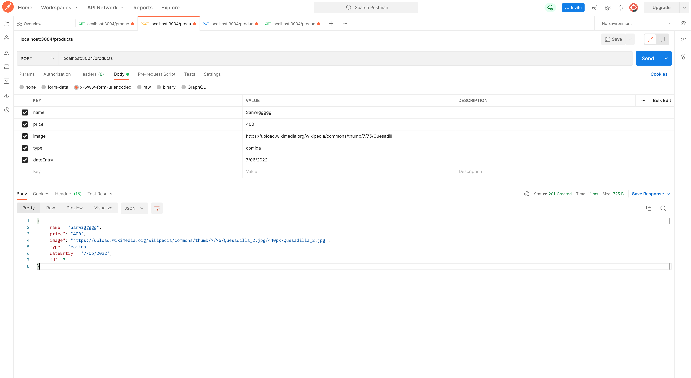
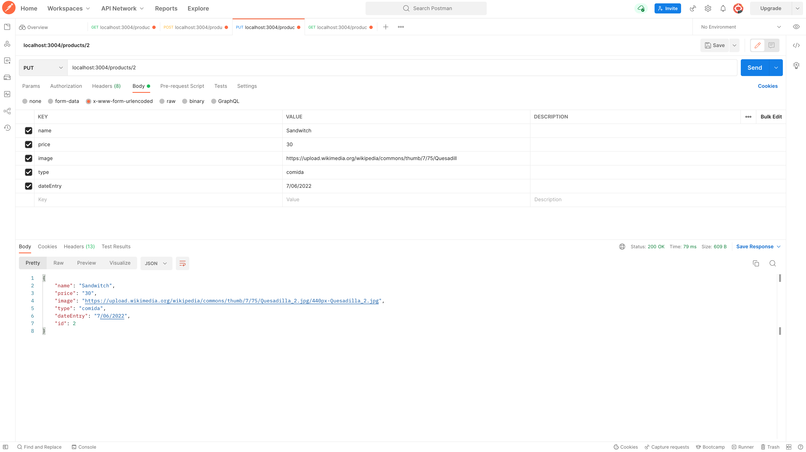
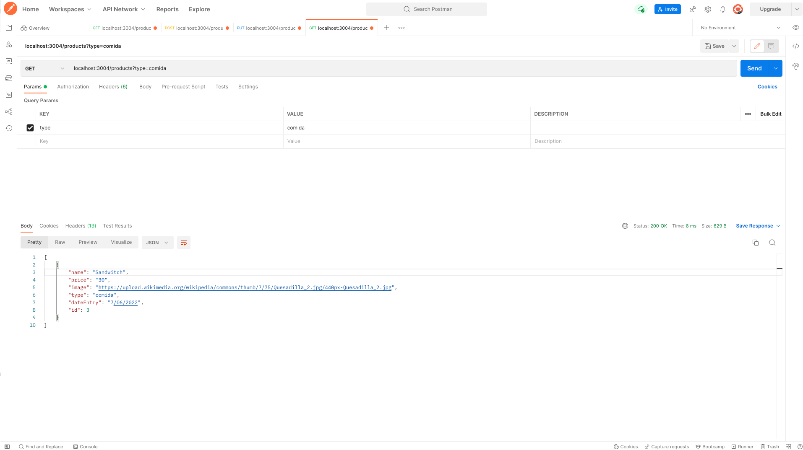

# API REST

## Algo de teoría

### Que es una API  REST ?

Una API de REST, o API de RESTful, es una interfaz de programación de aplicaciones (API o API web) que se ajusta a los límites de la arquitectura REST y permite la interacción con los servicios web de RESTful. El informático Roy Fielding es el creador de la transferencia de estado representacional (REST).

Las API son conjuntos de definiciones y protocolos que se utilizan para diseñar e integrar el software de las aplicaciones.Suele considerarse como el contrato entre el proveedor de información y el usuario, donde se establece el contenido que se necesita por parte del consumidor (la llamada) y el que requiere el productor (la respuesta).Por ejemplo, el diseño de una API de servicio meteorológico podría requerir que el usuario escribiera un código postal y que el productor diera una respuesta en dos partes: la primera sería la temperatura máxima y la segunda, la mínima.

### Que es un endpoint ?

Los endpoints son las URLs de un API o un backend que responden a una petición. Los mismos entrypoints tienen que calzar con un endpoint para existir. Algo debe responder para que se renderice un sitio con sentido para el visitante. Por cada entrypoint esperando la visita de un usuario puede haber docenas de endpoints sirviendo los datos para llenar cada gráfico e infografía que se despliega en el entrypoint

---

## Recursos usados en el video

- [Json Server](https://www.npmjs.com/package/json-server)
- [Postman](https://www.postman.com)
- [Thunder](https://www.thunderclient.com)

## Algunas capturas de pantalla

### get

### post

### put & detail

### filter

